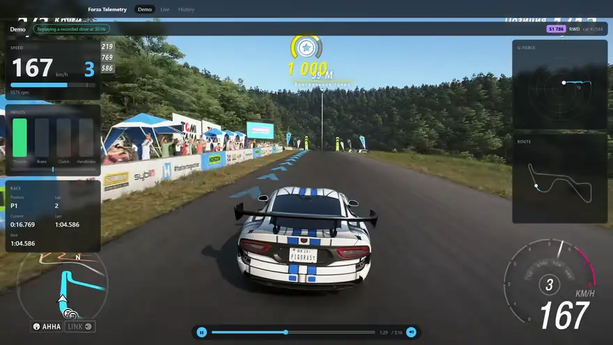
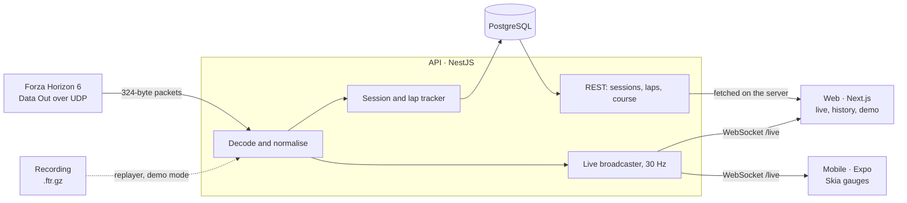

# Forza Telemetry

**English** · [Русский](README.ru.md)

[](https://github.com/mrdenzzz/forza-telemetry/actions/workflows/ci.yml)
[](LICENSE)

Real-time telemetry for Forza Horizon 6. A NestJS service ingests the game's UDP "Data Out" stream, detects sessions and laps, stores lap analytics in Postgres, and streams live data to a Next.js dashboard and a React Native gauge cluster.

[](https://forza.mrdenzzz.ru/demo)

## Live demo

The hosted demo runs on a recorded race, so it works while nobody is playing:

- **[Demo](https://forza.mrdenzzz.ru/demo):** the race on video, with the dashboard drawn over it in sync.
- **[Live](https://forza.mrdenzzz.ru/):** the live dashboard, fed by the API replaying the same race.
- **[History](https://forza.mrdenzzz.ru/sessions):** the race's laps and their comparison.

## What it does

- **Live dashboard.** Speed, revs, gear, pedals and steering, a g-force trail, tyre temperatures and grip, lap times, a route map and 30-second charts. Frames arrive over WebSocket at 30 Hz and never re-render the page as a whole.
- **Sessions and laps.** The API recognises races, laps and rewinds in the raw stream, and stores a trace of every lap. The history compares any two laps along the same distance.
- **Phone.** An Expo app with Skia gauges that glide at the screen's refresh rate.
- **Recordings.** Raw packets with their arrival times. You can record, replay over UDP and trim them. Tests and the hosted demo run on recordings.

## Architecture



Shared packages keep the parts in agreement:

- **`@ft/telemetry-protocol`:** the packet layout and its decoder.
- **`@ft/contracts`:** zod schemas for every message and response.
- **`@ft/live-client`:** the connection, the store and the display rules, shared by the web and mobile apps.
- **`@ft/recording`:** the recording format.

The decisions behind the design are recorded in the [ADRs](docs/adr/README.md).

| Area      | Stack                                                                |
| --------- | -------------------------------------------------------------------- |
| Monorepo  | pnpm workspaces, Turborepo, TypeScript 6                             |
| API       | NestJS 12, RxJS, WebSocket (`ws`), Prisma 7, PostgreSQL 17, pino     |
| Web       | Next.js 16, React 19, canvas, uPlot                                  |
| Mobile    | Expo SDK 57, React Native 0.86, Reanimated 4, Skia                   |
| Contracts | zod 4, shared by the API and both apps                               |
| Tests     | Vitest, Testing Library, Jest for the mobile app, PGlite as Postgres |
| Delivery  | GitHub Actions, Docker, GHCR, nginx, Let's Encrypt                   |

## Repository layout

```
apps/        deployable applications (api, web, mobile)
packages/    shared libraries and configuration
tools/       developer CLIs (recorder, replayer)
deploy/      the hosted demo: nginx config and the drive it replays
docs/        architecture decision records, protocol reference, deployment
```

## Getting started

> **Requirements: Node.js 24.11 or newer** and pnpm 12 (`npm install --global pnpm@12`).
> The recorder and replayer run TypeScript directly with Node's built-in type stripping, so older versions fail; `pnpm install` refuses them up front.

```sh
pnpm install
pnpm check
```

| Script           | What it does                                    |
| ---------------- | ----------------------------------------------- |
| `pnpm dev`       | Run the API and the dashboard in watch mode     |
| `pnpm check`     | Lint, typecheck, test and build every workspace |
| `pnpm lint`      | ESLint with type-aware rules                    |
| `pnpm typecheck` | TypeScript in every workspace                   |
| `pnpm test`      | Unit and integration tests                      |
| `pnpm build`     | Production builds                               |
| `pnpm format`    | Format the repository with Prettier             |
| `pnpm record`    | Record the game's telemetry to a file           |
| `pnpm replay`    | Replay a recording over UDP                     |
| `pnpm trim`      | Cut a stretch of a recording into a new file    |

Commits follow [Conventional Commits](https://www.conventionalcommits.org/); a git hook installed by `pnpm install` checks messages and formats staged files.

## Connecting the game

In Forza Horizon 6, open Settings → HUD and Gameplay and set:

- **Data Out** to On;
- **Data Out IP Address** to `127.0.0.1`;
- **Data Out IP Port** to `9876`.

Microsoft Store and PC Game Pass builds also need a [loopback exemption](docs/fh6-data-out.md#network-setup-on-windows).

## Running locally

```sh
pnpm --filter @ft/api db:local                    # PostgreSQL without Docker (embedded PGlite) on 127.0.0.1:5433; keep it running
cp apps/api/.env.example apps/api/.env            # once: points the API at that database
pnpm --filter @ft/api db:migrate                  # once, and again after pulling new migrations
pnpm dev                                          # dashboard on http://localhost:3000, API on :4000, telemetry on UDP 9876
pnpm replay recordings/<file>.ftr.gz --loop       # without the game: replay a recording into it
```

The dashboard follows the game live. The API:

- streams over WebSocket at `ws://localhost:4000/live`;
- records sessions and laps into the database and serves them at `GET /sessions`;
- reports on `GET /health` whether the game is sending.

Any PostgreSQL works in place of `db:local`: set `DATABASE_URL` in `apps/api/.env`. Details: [dashboard](apps/web/README.md), [API](apps/api/README.md).

The whole stack also runs in Docker: `cp .env.example .env`, set a password, then `docker compose up --build`.

## On a phone

```sh
pnpm --filter @ft/mobile start                   # scan the QR code with Expo Go (SDK 57) on the same Wi-Fi
```

The app is a landscape dashboard with the same live data; it suggests this computer as the API address. Details, including the Windows firewall: [mobile app](apps/mobile/README.md).

## Recording and replaying

The game streams only while you drive, so development, tests and the hosted demo run on recordings.

```sh
pnpm record --note "Goliath, 3 laps"
pnpm replay recordings/fh6-<timestamp>.ftr.gz --loop
```

See [recorder](tools/recorder/README.md), [replayer](tools/replayer/README.md) and [ADR 0002](docs/adr/0002-recording-format.md) on the file format.

## Deployment

The demo runs on one VPS: Docker Compose behind the server's own nginx, with images built by CI and published to GHCR. The API replays a recorded race in a loop instead of listening for the game.

- [docs/deploy.md](docs/deploy.md): the steps, including how the demo video and its telemetry are made and kept in sync.
- [ADR 0008](docs/adr/0008-hosting-on-a-vps.md): the reasons.

## Documentation

Every document has a Russian translation (`*.ru.md`) linked at its top.

- [Forza Horizon 6 "Data Out" reference](docs/fh6-data-out.md): packet layout, sources, open questions, network setup
- [Architecture decision records](docs/adr/README.md)
- [Deploying the demo](docs/deploy.md)

## Roadmap

- [x] Monorepo foundation: workspaces, shared configs, CI
- [x] Packet parser, recorder and replayer
- [x] API: UDP ingest and live WebSocket stream
- [x] Web: live dashboard
- [x] Sessions, laps, history and lap comparison
- [x] Mobile: live gauges
- [x] Docker, deployment, demo mode

## License

[MIT](LICENSE)

---

Not affiliated with or endorsed by Microsoft, Xbox Game Studios or Playground Games. Forza Horizon is a trademark of Microsoft Corporation.
