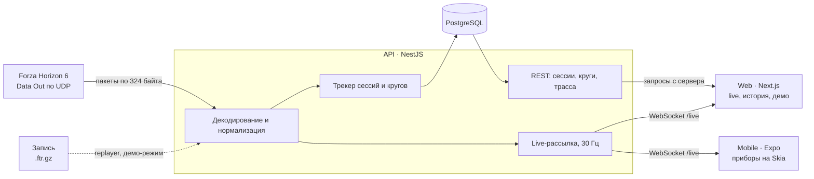

# Forza Telemetry

[English](README.md) · **Русский**

[](https://github.com/mrdenzzz/forza-telemetry/actions/workflows/ci.yml)
[](LICENSE)

Телеметрия Forza Horizon 6 в реальном времени. Сервис на NestJS принимает UDP-поток «Data Out» из игры, определяет сессии и круги, сохраняет аналитику кругов в Postgres и транслирует живые данные в дашборд на Next.js и приборную панель на React Native.

[](https://forza.mrdenzzz.ru/demo)

## Живое демо

Демо работает на записанной гонке, поэтому его можно смотреть, даже когда в игру никто не играет:

- **[Демо](https://forza.mrdenzzz.ru/demo):** видео гонки с дашбордом поверх, синхронно.
- **[Live](https://forza.mrdenzzz.ru/):** live-дашборд, который питает API, проигрывая ту же гонку.
- **[История](https://forza.mrdenzzz.ru/sessions):** круги этой гонки и их сравнение.

## Что умеет

- **Live-дашборд.** Скорость, обороты, передача, педали и руль, след перегрузок, температура и сцепление шин, время кругов, карта маршрута и 30-секундные графики. Кадры приходят по WebSocket 30 раз в секунду и никогда не перерисовывают страницу целиком.
- **Сессии и круги.** API распознаёт в сыром потоке гонки, круги и перемотки и сохраняет трассу каждого круга. История сравнивает любые два круга по одной дистанции.
- **Телефон.** Приложение на Expo с приборами на Skia, которые плавно движутся с частотой экрана.
- **Записи.** Сырые пакеты со временем прихода. Их можно записать, проиграть по UDP и обрезать. На записях работают тесты и публичное демо.

## Архитектура



Общие пакеты держат части в согласии:

- **`@ft/telemetry-protocol`:** раскладка пакета и его декодер.
- **`@ft/contracts`:** схемы zod для всех сообщений и ответов.
- **`@ft/live-client`:** подключение, store и правила отображения, общие для веба и мобилки.
- **`@ft/recording`:** формат записей.

Решения, на которых держится устройство проекта, записаны в [ADR](docs/adr/README.ru.md).

| Область   | Стек                                                              |
| --------- | ----------------------------------------------------------------- |
| Монорепо  | pnpm workspaces, Turborepo, TypeScript 6                          |
| API       | NestJS 12, RxJS, WebSocket (`ws`), Prisma 7, PostgreSQL 17, pino  |
| Web       | Next.js 16, React 19, canvas, uPlot                               |
| Mobile    | Expo SDK 57, React Native 0.86, Reanimated 4, Skia                |
| Контракты | zod 4, общие для API и обоих приложений                           |
| Тесты     | Vitest, Testing Library, Jest для мобилки, PGlite в роли Postgres |
| Доставка  | GitHub Actions, Docker, GHCR, nginx, Let's Encrypt                |

## Структура репозитория

```
apps/        приложения, которые деплоятся (api, web, mobile)
packages/    общие библиотеки и конфигурация
tools/       CLI для разработки (recorder, replayer)
deploy/      публичное демо: конфиг nginx и проигрываемый заезд
docs/        архитектурные решения, описание протокола, деплой
```

## Быстрый старт

> **Нужны Node.js 24.11 или новее** и pnpm 12 (`npm install --global pnpm@12`).
> Recorder и replayer запускают TypeScript напрямую через встроенное в Node удаление типов, поэтому на старых версиях они не работают; `pnpm install` отказывается ставиться на них сразу.

```sh
pnpm install
pnpm check
```

| Скрипт           | Что делает                                        |
| ---------------- | ------------------------------------------------- |
| `pnpm dev`       | Запуск API и дашборда в режиме watch              |
| `pnpm check`     | Линт, проверка типов, тесты и сборка всех пакетов |
| `pnpm lint`      | ESLint с правилами, использующими типы            |
| `pnpm typecheck` | Проверка типов TypeScript во всех пакетах         |
| `pnpm test`      | Модульные и интеграционные тесты                  |
| `pnpm build`     | Продакшен-сборки                                  |
| `pnpm format`    | Форматирование репозитория через Prettier         |
| `pnpm record`    | Запись телеметрии игры в файл                     |
| `pnpm replay`    | Воспроизведение записи по UDP                     |
| `pnpm trim`      | Вырезать отрезок записи в новый файл              |

Коммиты оформляются по [Conventional Commits](https://www.conventionalcommits.org/ru/v1.0.0/). Git-хук, который ставится при `pnpm install`, проверяет сообщения коммитов и форматирует индексированные файлы.

## Подключение игры

В Forza Horizon 6 откройте Settings → HUD and Gameplay и установите:

- **Data Out** — On;
- **Data Out IP Address** — `127.0.0.1`;
- **Data Out IP Port** — `9876`.

Версиям из Microsoft Store и PC Game Pass также нужно [исключение для loopback](docs/fh6-data-out.ru.md#настройка-сети-в-windows).

## Локальный запуск

```sh
pnpm --filter @ft/api db:local                    # PostgreSQL без Docker (встроенный PGlite) на 127.0.0.1:5433; оставить запущенным
cp apps/api/.env.example apps/api/.env            # один раз: направляет API на эту базу
pnpm --filter @ft/api db:migrate                  # один раз и снова после получения новых миграций
pnpm dev                                          # дашборд на http://localhost:3000, API на :4000, телеметрия на UDP 9876
pnpm replay recordings/<файл>.ftr.gz --loop       # без игры: проиграть в него запись
```

Дашборд показывает игру в реальном времени. API:

- отдаёт поток по WebSocket на `ws://localhost:4000/live`;
- записывает сессии и круги в базу и отдаёт их на `GET /sessions`;
- сообщает на `GET /health`, присылает ли игра данные.

Вместо `db:local` подойдёт любой PostgreSQL: задайте `DATABASE_URL` в `apps/api/.env`. Подробнее: [дашборд](apps/web/README.ru.md), [API](apps/api/README.ru.md).

Весь стек запускается и в Docker: `cp .env.example .env`, задайте пароль и выполните `docker compose up --build`.

## На телефоне

```sh
pnpm --filter @ft/mobile start                   # отсканировать QR-код в Expo Go (SDK 57) в той же сети Wi-Fi
```

Приложение — горизонтальный дашборд с теми же live-данными; в качестве адреса API оно предлагает этот компьютер. Подробности, включая брандмауэр Windows: [мобильное приложение](apps/mobile/README.ru.md).

## Запись и воспроизведение

Игра отправляет данные, только пока вы едете, поэтому разработка, тесты и публичное демо работают на записях.

```sh
pnpm record --note "Goliath, 3 круга"
pnpm replay recordings/fh6-<timestamp>.ftr.gz --loop
```

Подробнее: [recorder](tools/recorder/README.ru.md), [replayer](tools/replayer/README.ru.md) и [ADR 0002](docs/adr/0002-recording-format.ru.md) о формате файла.

## Деплой

Демо работает на одном VPS: Docker Compose за собственным nginx сервера, образы собирает CI и публикует в GHCR. API не слушает игру, а проигрывает записанную гонку по кругу.

- [docs/deploy.ru.md](docs/deploy.ru.md): шаги, в том числе как делаются видео демо и его телеметрия и как они синхронизируются.
- [ADR 0008](docs/adr/0008-hosting-on-a-vps.ru.md): причины такого выбора.

## Документация

У каждого документа есть русская версия (`*.ru.md`), ссылка на неё стоит в начале документа.

- [Справочник по «Data Out» Forza Horizon 6](docs/fh6-data-out.ru.md): раскладка пакета, источники, открытые вопросы, настройка сети
- [Архитектурные решения (ADR)](docs/adr/README.ru.md)
- [Деплой демо](docs/deploy.ru.md)

## План

- [x] Основа монорепо: workspaces, общие конфиги, CI
- [x] Парсер пакета, recorder и replayer
- [x] API: приём UDP и live-поток по WebSocket
- [x] Web: live-дашборд
- [x] Сессии, круги, история и сравнение кругов
- [x] Mobile: live-приборы
- [x] Docker, деплой, демо-режим

## Лицензия

[MIT](LICENSE)

---

Проект не связан с Microsoft, Xbox Game Studios и Playground Games и не одобрен ими. Forza Horizon — товарный знак Microsoft Corporation.
